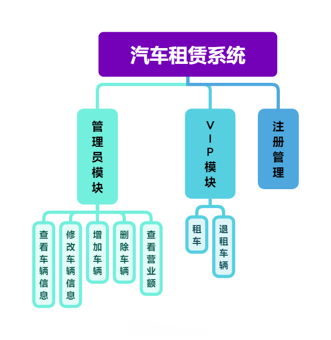

# 汽车租赁系统说明书

[toc]


## 需求分析

本系统实现了高级版三种车型的汽车租赁平台的运行与管理。

### （1）用户

本系统用户分为两类，一类是**有租车需求的人群**，一类是**系统管理员用户**。

### （2）场景

用户在需要租车的时候，会选择使用本系统。

### （3）问题

用户在有需求的时候，会面临以下问题：

1. 没有租车平台，租车无处可寻。
2. 不知道有什么品牌和型号的车辆适合自己。
3. 租车之后退租有一定困难。
4. 担心交易不够透明

租车公司会面临以下问题：

1. 车辆信息展示不够明确
2. 营业额难以计算
3. 查找车辆信息困难
4. 无法动态修改车辆信息

### （4）方案

本系统为用户提供了一个公开透明的租车平台，内部向用户展示了三种所有可用的车辆的品牌，型号，价钱等基本信息，用户可以根据自己的需要选择租赁各种车辆，同时线上直接付款，方便快捷。如果用户想要退租车辆，本系统也完全支持此操作。

与此同时，本系统为租车公司提供了优质的车辆管理解决方案，公司可以轻易地将拥有的车辆信息展示出来，同时可以动态修改所有车辆信息，并且本系统提供了一个多线程快速计算营业额的解决方法，方便快捷。

---


## 功能结构图



查看车辆信息：查看车辆信息

修改车辆信息：修改车辆信息

增加车辆：增加车辆

查看营业额：利用多线程计算每一种汽车的营业额总和

VIP模块：支持用户登录后租车，退车，付款

注册管理：支持注册新用户

---

## 类图


项目结构：


> `UserService`:用户服务类，和其子类用于接受用户操作请求
>
> `VehicleMapper`:数据库Mybatis代理类，用于执行sql语句
>
> `Vehicle`:实体父类，用于存储车辆信息
>
> `Login`:登录服务类，用于处理登陆事宜
>
> `Register`:注册类，用于处理注册事宜
>
> `Pay`:多线程类，用于计算营业额
>
> `RentMgr`：主类
>
> `DaoInit`:数据层初始化
>
> `ConsRent`：常量类

---

## 系统测试设计

| 用例编号 | 用例标题               | 输入数据               | 预测结果                 |
| -------- | ---------------------- | ---------------------- | ------------------------ |
| LU1      | 对用户名和密码进行输入 | 用户名:test 密码：test | 正确进入系统             |
| LU2      | 注册测试               | 用户名:test 密码：test | 正确注册，数据存入数据库 |
| LU3      | 租车测试               | 2                      | 正确租车                 |
| LU4      | 退车测试1              | 2                      | 正确退车                 |
| LU5      | 退车测试2              | 2                      | 返回退车失败，成功       |
| LU6      | 修改信息测试           | 车辆信息               | 成功修改                 |
| LU7      | 营业额测试             | \                      | 成功计算营业额           |

---

# 代码实现

详情见附件。

---

# 面向对象方法特性

- 继承：

```java
package com.rentcar.service;

import com.rentcar.mapper.VehicleMapper;

public interface CustomerService extends UserService {
    void Todo();

    Boolean rentCar(VehicleMapper vehicleMapper);
}
```

其余略

- 多态

```java
    public Vehicle creatV(String name) {
        switch (name) {
            case "Vehicle":
                return new Vehicle();
            case "Car":
                return new Car();
            case "Trunk":
                return new Trunk();
            case "Bus":
                return new Bus();
            default:
                return null;
        }
    }

// ........

@Override
    public Boolean addCar(VehicleMapper vehicleMapper) {
        CourseFactory factory = new CourseFactory();
        // 使用简单工厂创建实例对象
        Vehicle car = factory.creatV("Car");
        ......
    }
```

其余略

- 集合框架

```java
    @Override
    public void run() {
        List<Vehicle> vehicles = vehicleMapper.selectBusPay();
        for (Vehicle vehicle : vehicles) {
            res += vehicle.getPrice() * vehicle.getDays();
        }
    }
```

其余略

- 异常处理

```java
    public static void main(String[] args) {
        while (flag) {
            try {
                System.out.println(ConsRent.welcome);
                int choice = input.nextInt();
                switch (choice) {
                    case 1:
                        loginAdmin();
                        break;
                    case 2:
                        loginUser();
                        break;
                    case 3:
                        registerUser();
                        break;
                }
            } catch (InputMismatchException e) {
                System.out.println(ConsRent.errorSelAdmin);
                input.nextLine();
            }
        }
    }
```

```java
    {
        try {
            sqlSessionVehicleMapperPair = DaoInit.init();
        } catch (IOException e) {
            throw new RuntimeException(e);
        }
    }
```

其余略

- 多线程

```java
    @Override
    public Float rentPay(VehicleMapper vehicleMapper) {
        CarPay carPay = new CarPay(vehicleMapper);
        TrunkPay trunkPay = new TrunkPay(vehicleMapper);
        BusPay busPay = new BusPay(vehicleMapper);
        carPay.start();
        trunkPay.start();
        busPay.start();
        try {
            carPay.join();
            trunkPay.join();
            busPay.join();
        } catch (InterruptedException e) {
            throw new RuntimeException(e);
        }
        return carPay.res + trunkPay.res + busPay.res;
    }
```

其余略

- 工厂模式

```java
package com.rentcar.factory;

import com.rentcar.entity.pojo.*;

public class CourseFactory {
    public Vehicle creatV(String name) {
        switch (name) {
            case "Vehicle":
                return new Vehicle();
            case "Car":
                return new Car();
            case "Trunk":
                return new Trunk();
            case "Bus":
                return new Bus();
            default:
                return null;
        }
    }

    public User creatU(String name) {
        switch (name) {
            case "User":
                return new User();
            default:
                return null;
        }
    }
}
```

```java
    @Override
    public User loginAdmin(String name, String password) {
        CourseFactory factory = new CourseFactory();
        User user = factory.creatU("User");
        String md5Password = getAdminPassword(sqlSessionVehicleMapperPair.getValue(), name);
        password = DigestUtils.md5Hex(password);
        if (Objects.equals(password, md5Password)) {
            user.setUserName(name);
            user.setUserPwd(password);
            user.setUserKind(1);
        } else
            user.setUserKind(0);

        return user;
    }
```

其余略
